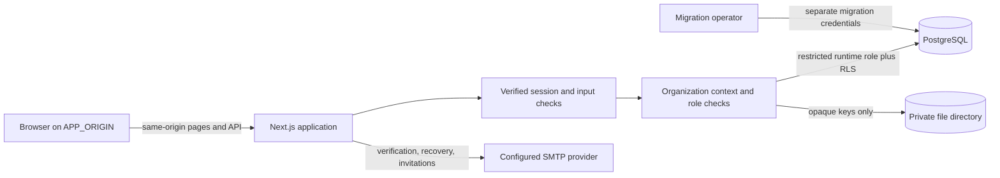
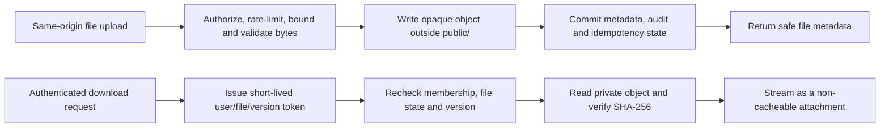

# Nexora

Nexora is a team project workspace for organizing projects, milestones, tasks, and collaboration in one tenant-scoped product. PostgreSQL is authoritative for accounts, workspaces, projects, and work-item data. The uploaded product requirements document is the product contract; it is not required to build or run this repository.

This repository is an actively developed local foundation, not a production-ready service. AI and real-time collaboration are not implemented. The current file backend is a private local filesystem and needs durable encrypted shared storage before a multi-instance deployment.

## Included

- Accounts with email verification, password reset, opaque database-backed sessions, and rate limits.
- Organization and project roles, verified-email invitations, membership controls, and tenant-aware PostgreSQL row-level security.
- Projects, milestones, tasks, configurable workflows, Kanban/list views, comments, mentions, activity, and in-app notifications.
- Private task attachments with content validation, scoped access, short-lived signed downloads, version-checked replacement, and 30-day retention logic.
- Permission-aware workspace search and project analytics calculated from authorized PostgreSQL data.

AI-generated insights, email notification delivery, presence, and WebSocket synchronization are not available. Analytics are deterministic summaries, not AI predictions.

## Architecture at a Glance



For project data, identity and tenant context are set inside each database transaction. PostgreSQL RLS is a second boundary, not a replacement for the server-side membership and role checks. The browser never receives database credentials or file storage keys.



## Requirements

- Node.js 22 or newer.
- PostgreSQL 16 or newer.
- Two separate PostgreSQL roles: a migration owner and a restricted runtime role. The runtime role must not own application tables and must not have `SUPERUSER`, `BYPASSRLS`, `CREATEDB`, or `CREATEROLE`.

Install dependencies and create a local environment file:

```sh
npm ci
cp .env.example .env.local
```

Generate distinct secrets for `AUTH_RATE_LIMIT_HMAC_KEY` and `NEXORA_FILE_SIGNING_KEY` with `openssl rand -hex 32`. Keep `.env.local` out of version control and never use production credentials for development or tests.

Create the local database roles and database using an administrative PostgreSQL account. Replace the example passwords with strong, unique values:

```sql
CREATE ROLE nexora_migrator LOGIN PASSWORD 'replace-this-migrator-password'
  NOSUPERUSER NOCREATEDB NOCREATEROLE NOINHERIT;
CREATE ROLE nexora_app LOGIN PASSWORD 'replace-this-runtime-password'
  NOSUPERUSER NOCREATEDB NOCREATEROLE NOBYPASSRLS;
CREATE DATABASE nexora OWNER nexora_migrator;
GRANT CONNECT ON DATABASE nexora TO nexora_app;
```

Set `MIGRATOR_DATABASE_URL` to the database using `nexora_migrator` and `DATABASE_URL` to the same database using `nexora_app`. Then apply migrations and the runtime grants:

```sh
npm run db:migrate
psql "$MIGRATOR_DATABASE_URL" -v ON_ERROR_STOP=1 -f db/runtime-grants.sql
npm run dev
```

The migration runner uses an advisory lock, applies each numbered migration transactionally, records SHA-256 checksums, and refuses changes to applied migrations. Add a new migration for every schema or policy change. Apply `db/runtime-grants.sql` as the migration owner after migrations on each database.

The Node-based migration, test, and file-cleanup scripts load `.env.local` when it exists; variables already present in the process environment take precedence. Next.js loads the same file for app commands.

## Configuration

`.env.example` documents the supported settings. In addition to the database URLs and secrets:

- Set `APP_ORIGIN` to the canonical browser origin used by same-origin mutation checks and account links.
- Configure SMTP for verification, recovery, and invitations. TLS is required by default; `SMTP_REQUIRE_TLS=false` is for controlled local-only testing.
- Set `NEXORA_PRIVATE_FILE_DIR` to a dedicated server-only directory outside `public/`. Production needs durable encrypted storage shared by app and cleanup instances.
- In production, set `NEXORA_TRUSTED_CLIENT_IP_HEADER` to one client-IP header overwritten by a trusted ingress. Do not trust a client-supplied `X-Forwarded-For` chain.
- Keep `MIGRATOR_DATABASE_URL` separate from the restricted runtime `DATABASE_URL`; never expose either to the browser.
- The browser application and API are same-origin only. No CORS allow-origin response header is enabled; do not add a wildcard or credentialed cross-origin policy at the app or ingress.

File uploads are limited to 10 MiB each, 20 active files and 100 MiB per task. Deleted files become inaccessible immediately and are physically purged after 30 days. Schedule `npm run files:cleanup` at least daily with the restricted runtime role and the same private storage mount. The command is provided, but the repository does not configure or monitor a scheduler. Optional malware scanning is not configured; uploaded documents must not be treated as trusted input.

## Checks

```sh
npm run lint
npm run typecheck
npm test
npm run check
npm run build
```

`npm run check` runs lint, typecheck, and tests. PostgreSQL integration cases run only when `NEXORA_TEST_DATABASE_URL` is configured; without it, those cases are skipped. For full local verification, create a disposable `nexora_test` database with the same separate roles, set `NEXORA_TEST_MIGRATOR_DATABASE_URL` and `NEXORA_TEST_DATABASE_URL` in `.env.local`, then run:

```sh
MIGRATOR_DATABASE_URL="$NEXORA_TEST_MIGRATOR_DATABASE_URL" npm run db:migrate
psql "$NEXORA_TEST_MIGRATOR_DATABASE_URL" -v ON_ERROR_STOP=1 -f db/runtime-grants.sql
npm run check
```

The database test suite writes fixture rows and must never point to production or persistent user data. The `.env.example` values are placeholders, not working credentials.

## Security Boundaries

Tenant-aware server code must derive identity from a verified server-side session and use `withOrganizationContext(userId, organizationId, callback, minimumRole)`. Do not accept user IDs or roles from request data. Use parameterized SQL and keep each tenant operation inside the helper's transaction. RLS is defense in depth, not a replacement for application authorization.

Authentication cookies are host-only, `HttpOnly`, `SameSite=Strict`, and `Secure` in production. Session and email-link tokens are stored as hashes. Mutations require the canonical origin and reject cross-site Fetch Metadata. Task files stay outside public paths; API responses never expose storage keys. See `docs/threat-model.md` for current controls and residual risks.

Nexora does not enable cross-origin API access: JSON responses do not include `Access-Control-Allow-Origin`, and mutation handlers require the configured `APP_ORIGIN`. CORS is not authentication; an ingress must not add wildcard CORS headers or credentialed access from untrusted sites.

## Project Notes

- `docs/prd-traceability.md` tracks implementation and verification against all 45 PRD sections.
- `docs/architecture.md` documents system boundaries, API behavior, and deferred infrastructure.
- `docs/threat-model.md` records threats, current controls, verification, and remaining deployment risks.

Local tests, a successful production build, and this documentation are not evidence of production readiness, regulatory compliance, accessibility certification, performance capacity, or an independent security assessment. Configure backups and restore tests, monitoring, encrypted shared storage, SMTP, trusted ingress, and an operational cleanup schedule before launch.
