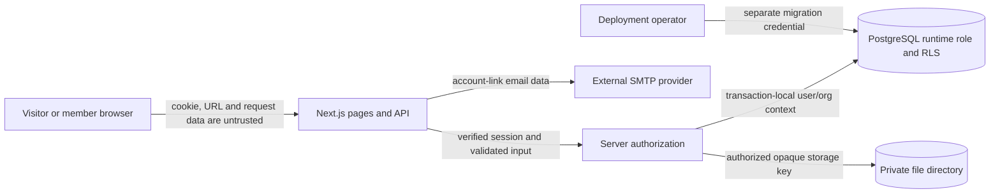

# Threat Model (Initial)

This is a living threat model, not a claim that Nexora is production-secure. A disposable PostgreSQL 16.12 database applied migrations `0001`–`0022`; all 82 tests, including the database-backed cases, passed with zero skips. See the dated audit for scope and limits. Unimplemented modules and production operational controls remain release blockers.

## Scope, Actors, and Trust Boundaries

Actors are unauthenticated visitors, authenticated workspace/project members, organization/project managers, the deployment operator, and configured SMTP infrastructure. The application treats browser-supplied identity and role claims as untrusted. Trust is established from the server-side session, rechecked membership, and transaction-local database context.

The browser-to-server and runtime-server-to-database boundaries are security boundaries. SMTP is an external data recipient. The private storage path is server-only. The migration operator is highly privileged and must not use the application runtime role. A database owner, superuser, arbitrary SQL execution, or compromised application process is outside RLS protection.

Residual-risk levels are qualitative: **High** means a direct tenant-data compromise or material service disruption remains possible without a named control; **Medium** means a bounded but meaningful exposure or abuse path remains; **Low** means impact is constrained but still merits monitoring. Ratings describe the residual risk before deployment follow-ups, not a formal risk calculation.

## Representative Attack Paths

| Attack path | Existing control and evidence | Residual risk |
| --- | --- | --- |
| Forge an organization/project identifier to read or mutate another tenant's data | Server session identity, membership check before tenant context, role checks and RLS; see `src/server/db.ts`, `tests/db-rls.integration.test.ts`, and feature integration tests. | **High** until the full route/resource matrix and deployed least-privilege DB role are independently verified. |
| Send a cookie-authenticated mutation from an attacker site or script | Host-only `SameSite=Strict` cookies, exact `APP_ORIGIN`, Fetch Metadata checks, and no `Access-Control-Allow-Origin`; see `src/server/api.ts` and `tests/api-guards.test.ts`. | **Medium** if an ingress adds permissive CORS or deployment origins/headers are misconfigured. |
| Rotate a forwarded-IP header to evade IP quotas | App validates the configured header's IP syntax and HMAC-hashes the subject. | **High** unless private ingress strips any client-supplied copy and overwrites the configured single-IP header; application code cannot prove who set it. |
| Race dependency writes to commit a cycle | Advisory locking plus an authorized per-project graph-lock row; stale repeatable-read snapshots abort with SQLSTATE `40001`, which is returned as a safe conflict. Regression cases cover opposite-edge inserts at default and repeatable-read isolation; these passed on disposable PostgreSQL 16.12. | **Medium**; retry policy, contention, and load behavior remain to be evaluated. |
| Upload, replace, or race download of a private file | Bounded streaming, private canonical storage paths, content checks, version preconditions, row locks, digest validation, staged-object handling on known vs. ambiguous commits, and the narrowly scoped download lock from migration `0022`. PostgreSQL 16.12 route tests cover viewer downloads and file lifecycle behavior. | **High** until durable encrypted shared storage, cleanup scheduling, malware-scanning decision, and live deployment behavior are verified. |
| Abuse rate limits until the database counter overflows | Migration `0021` caps counters at the schema's 1000-attempt maximum while continuing to deny requests; `tests/auth-db.integration.test.ts` exercises repeated denied attempts. The migration and integration case passed on disposable PostgreSQL 16.12. | **Low** for counter overflow in the tested path; production abuse/load behavior and rate-limit data retention remain to be evaluated. |

## Verification Map

- Authentication, session and token behavior: `tests/auth-schemas.test.ts`, `tests/password.test.ts`, `tests/auth-db.integration.test.ts`, and `tests/auth-api.integration.test.ts`.
- Tenant access, RLS and database role boundaries: `tests/db-rls.integration.test.ts` and `db/runtime-grants.sql`.
- Project, task, milestone, collaboration and concurrent graph behavior: `tests/project-management.integration.test.ts`, `tests/migration-guards.test.mjs`, and `db/migrations/0020_serialize_milestone_dependency_graph.sql` through `db/migrations/0022_lock_private_file_download_reads.sql`.
- File validation, private storage and transaction outcomes: `tests/private-files.test.ts`, `tests/db-transaction.test.ts`, and both task-file route handlers.
- Browser policy and same-origin API behavior: `tests/content-security-policy.test.ts` and `tests/api-guards.test.ts`.

Integration files skip database tests when `NEXORA_TEST_DATABASE_URL` is missing. The current PostgreSQL 16.12 run configured that URL and passed all 82 tests with zero skips; this disposable local evidence is not production verification.

| Threat | Attack surface and impact | Current mitigation | Verification | Residual risk |
| --- | --- | --- | --- | --- |
| Authentication and session theft | Password endpoints, cookies, resets, verification, invitation links, and active sessions could enable account takeover. | Scrypt password hashes, dummy-hash work for unknown accounts, single-use hashed email tokens, revocable opaque sessions, host-only `HttpOnly`/`SameSite=Strict` cookies, and password-reset session revocation. Invitation tokens are removed from the address bar after load and held in tab-scoped session storage during sign-in. | Unit and live PostgreSQL tests cover password/token handling, login, session lookup/logout, reset revocation, rate limits, invitation email binding, and replay rejection. | SMTP delivery, production cookie/TLS behavior, session inventory/revocation UX, and independent security review remain unverified. Do not treat this as production-ready. |
| Broken access control / IDOR | User-supplied organization IDs could expose another organization's data or allow unauthorized team changes. | Server derives identity from an active verified session; membership is checked before tenant context; owner setup requires creator identity; invite/member mutation routes require an active owner/admin and RLS. Acceptance binds the single-use token to the active account's verified email. | Pure authorization tests and live PostgreSQL RLS/API tests cover cross-user/org access, manager-only changes, self-change rejection, email-bound acceptance, and owner creation. | GUC identity is trusted application context. Arbitrary SQL execution or a runtime DB role that owns/bypasses tables could defeat RLS. |
| Cross-tenant data leakage | Queries, invitations, comments, mentions, notifications, search results, project workload/activity metrics, file metadata/content, audit records, or future AI/realtime context could cross tenant boundaries. | Transaction-local identity/org context; membership checked before setting org context; RLS scopes organization, membership, invitation, audit, project, milestone, task, task-comment, task-file, comment-mention, notification-preference, notification, workflow, dependency, and mutation-idempotency reads/writes. Search and analytics queries execute inside `withOrganizationContext`; analytics additionally checks `can_access_current_project`, filters every source by organization/project, and returns only bounded current-project summaries. Project-backed sources retain their RLS; member names come from the project-scoped member function. Signed download claims bind organization/project/task/file/user/version and recheck active membership and file state. Notifications force RLS and writes go through a constrained security-definer function. | PostgreSQL tests deny cross-tenant task-file reads, viewer writes, direct hard deletes, and visibility of another user's soft-deleted file; route tests verify project-reader downloads and authorized file mutation. Other feature-specific authorization coverage remains selected, not exhaustive. | Local disposable-database evidence is not production evidence; future tenant tables need their own RLS policies and tests before exposure. |
| API abuse and CSRF | Repeated login/search/mutations, forged cross-site requests, oversized uploads, or duplicate retries could consume resources or cause side effects. | Bounded JSON and streaming file bodies, strict schemas/content checks, short Search terms and bounded pagination, per-user/IP Search and file-upload rate limits, exact origin plus Fetch Metadata checks, no CORS allow-origin header, `SameSite=Strict`, DB fixed-window rate limits, HMAC-pseudonymized email/IP subjects, request timeouts. Task, milestone, comment and file creation use idempotency keys; replacement uses a version precondition; notification state/preferences use strict schemas and same-origin checks. | The current disposable PostgreSQL 16.12 suite passed all 82 tests with zero skips, including file lifecycle, RLS role-boundary, rate-limit and same-origin/CORS-header assertions. Production abuse/load testing remains. | Production must configure the canonical origin, HMAC keys, trusted single-IP ingress header, and request limits at ingress. Other mutation idempotency and load/abuse testing remain. |
| SQL injection / database privilege abuse | Unsafe SQL could expose or alter tenant data and identity records. | The tenant helper uses parameterized values; migration filenames are constrained and applied from fixed local files. Runtime/migrator URLs are separate. The internal dependency-graph lock table is not directly granted to the application role; a fixed-search-path security-definer function checks project authority before mutation. | Code review and static tests cover query construction. Earlier disposable databases confirmed the runtime role owned zero application relations and lacked superuser, `BYPASSRLS`, `CREATEROLE`, and `CREATEDB`; this must be rechecked after the current migration chain is applied. Adversarial SQL-injection assessment remains open. | Other future queries must remain parameterized. RLS is not a defense against arbitrary SQL that can change the session GUCs. |
| File upload and malicious content | Uploaded files could be oversized, mislabeled, path-traversal payloads, replaced concurrently, retained unexpectedly, or disclosed across projects. Documents may also contain malware or active content. | Bounded request streaming; 10 MB/file, 20 files/100 MB per task and upload rate limits; extension, declared MIME, UTF-8 and content-signature checks; path-safe filenames; opaque UUID storage keys; private directory/file permissions; project-scoped RLS and work authorization; five-minute HMAC links bound to user/project/task/file/version; membership, file state and SHA-256 rechecked on download; forced attachment disposition with `nosniff`; version-checked replacement; immediate logical deletion and 30-day physical-retention logic; operator-managed expired/orphan cleanup command. | PostgreSQL-backed route tests cover upload, metadata listing, signed downloads, replacement, viewer read/write boundaries, authorized soft delete, stale-link revocation, and hidden deleted rows. RLS tests deny cross-tenant reads, viewer writes, and direct hard deletes. Unit tests cover content validation, signed-link tampering/expiry, and storage permissions; tests do not prove the cleanup job runs. | **High until deployment controls are verified:** local filesystem requires durable encrypted storage and a shared mount across app instances. Optional malware scanning is not configured; do not render/process uploaded files as trusted content. Leaked signed links are bearer capabilities valid for at most five minutes. |
| WebSocket abuse | Forged connections/subscriptions could leak events, impersonate presence, or exhaust capacity. | No WebSocket service or channels exist. | Authentication, scoping, rate-limit, replay, reconnect, and stale-client tests are pending. | **High:** no realtime functionality is available. |
| AI prompt injection / exfiltration | Untrusted project text or files could cause unauthorized tool use or cross-tenant disclosure. | No AI provider or context retrieval exists. PRD requires server-side authorization before context retrieval. | The PRD's adversarial AI evaluation suite is pending. | **High:** AI must not be connected until scoped retrieval, structured-output validation, cost limits, and confirmation gates exist. |
| SMTP integration / SSRF | Verification, reset, and invitation email is sent through an external SMTP provider; provider abuse, credential compromise, delivery outage, and any future callback or URL-fetch path could expose users or internal services. | Nodemailer sends only application-generated links using the configured `APP_ORIGIN`; SMTP transport uses TLS by default. No arbitrary user-controlled URL fetch was found. | Email tests use a local capture SMTP server to inspect generated links; they do not verify provider TLS/authentication, delivery failure behavior, or production credentials. No SSRF assessment is recorded. | Provider disclosure, credential management, sending limits, outage behavior, and egress controls remain deployment/design risks. Treat any future URL fetch/callback as a separate allowlisted feature. |
| Infrastructure / availability | Database failure, pool exhaustion, deployment error, or stale jobs could corrupt or interrupt work. | Pool limits and connection/statement/query timeouts are configured. Migrations are advisory-locked and transactional; auth/workspace handlers return bounded safe errors. File storage uses staged opaque objects and a cleanup command that must be scheduled by the operator. Analytics is read-only and runs in a transaction with the existing query timeout. | See the dated PRD audit for current tests, typecheck, build, and browser-preview results. Health checks, retries, queues, alerts, and recovery tests are pending. | **High:** there is no deployable production topology or recovery evidence yet; persistent storage and an actual file-cleanup schedule must be provisioned and monitored. |
| Secrets and sensitive logging | Credentials in code/logs could compromise users or infrastructure. | `.env*` is ignored except `.env.example`; examples contain placeholders. Current code does not log request data or credentials. | Secret scanning and operational log review are pending. | Secret manager, rotation, and redaction behavior are not implemented. |
| Supply chain | Vulnerable or compromised packages/build actions could ship malicious code. | Direct package versions are pinned and lockfile is present. | `npm audit` reported zero vulnerabilities for the current lockfile; no CI workflow or independent supply-chain assessment is present yet. | Pin CI actions and keep dependency audits current before release. |
| XSS / clickjacking / browser policy | Unsafe output or framing could steal sessions or mislead users. | React escapes rendered text; `X-Frame-Options: DENY`, `nosniff`, `no-referrer`, and permissions policies are set. Page responses receive a per-request nonce CSP through Next.js `proxy`; progress bars use semantic `<progress>` elements rather than inline styles. | Policy-builder unit tests cover nonce/directive contents. Local HTTP smoke checks confirmed CSP headers and matching nonces on scripts on the home/login pages; remote browser-header regression and adversarial XSS tests remain. | CSP is not yet independently reviewed; API/static responses follow separate header paths, and authenticated UI receives session cookies. |
| Privacy / retention | Excess personal data or unbounded retention could expose users and violate product promises. | Auth tokens are not returned from APIs or stored in plaintext; rate-limit subjects are HMAC-derived; audit events and task comments are append-only for the runtime role. Comment create events record a comment ID, not a duplicate of the comment body. File metadata excludes storage paths from API responses; removed files are inaccessible immediately and purge logic retains them for 30 days. | Live PostgreSQL tests deny runtime comment update/delete and cross-tenant access. File retention behavior has unit/static coverage; the cleanup function's DB RLS behavior and configured schedule do not have live integration/deployment evidence. Data export/deletion tests remain. | Comments currently have no edit/delete path; timely file purge depends on a deployment operator configuring and monitoring the daily cleanup job. Retention periods for other data and expired rate-limit/token cleanup are not implemented or assessed. |

## Project Access Review

The post-migration PostgreSQL 16.12 re-check confirmed `nexora_app` owns zero relations in the `nexora` schema and has none of `SUPERUSER`, `BYPASSRLS`, `CREATEROLE`, or `CREATEDB`.

Project reads require an active organization member who owns the project, has an active project membership, or manages the organization. Project edits and membership changes require authority as the project owner, a project-role manager, or an organization manager; self-demotion and owner removal are blocked. Task comments and file metadata are visible to project readers; comments and file mutations are limited to work-authorized members. Mention tokens must resolve to active project members. File downloads use short-lived signed links that recheck the issuing user's membership and the current file version. Analytics is available only to project readers and returns aggregate task/milestone measures, project-member assignment counts, bounded upcoming dates, and recent project activity; it does not retrieve unrelated tenant records or infer member capacity. Notifications are recipient-only, project-visible, preference-aware, and append-only except for read state; local PostgreSQL/RLS integration passes. Operational and production verification remains outstanding.

## Required Deployment Controls

- Use a distinct, least-privileged runtime DB role. It must not own protected objects and must not have `SUPERUSER` or `BYPASSRLS`.
- Keep migration credentials separate from runtime credentials and outside logs/source control.
- Apply new schema policies and integration tests before exposing any new tenant table through an API.
- Treat `nexora.user_id` and `nexora.organization_id` as trusted only because authenticated server code sets them inside a transaction. Do not expose direct database access to clients.
- Use TLS to PostgreSQL and encrypted storage at rest through the hosting provider before production data is stored.
- Configure and monitor the daily `files:cleanup` job; the repository contains cleanup logic, not a deployed scheduler.
- Verify production page responses carry the nonce-based CSP and that the canonical `APP_ORIGIN`, trusted ingress, SMTP provider, and egress settings match the deployment.
- Do not describe Nexora as compliant with a regulation until controls and an independent assessment establish that claim.
